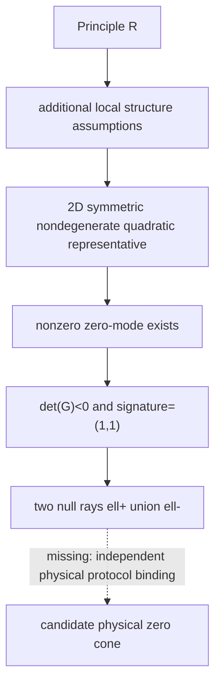

# Principle R -> Law-I

This repository checks one conditional local Law-I claim:

\[
\text{Principle R}
+ \text{two-dimensional local process plane}
+ \text{symmetric nondegenerate quadratic zero-set representation}
+ \text{physical zero-set binding}
\Longrightarrow
\det(G)<0,\quad \operatorname{sig}(G)=(1,1),\quad \ell_+\cup\ell_-.
\]

Current status: the conditional mathematics is closed; the signed-TESC
candidate reproduces the expected local zero-cone structure; the physical
zero-set binding and cross-protocol origin remain open.

| Layer | What is checked | Status |
|---|---|---|
| Mathematical | `det(G)<0`, signature `(1,1)`, two null rays | CERTIFIED |
| Operational | signed-TESC candidate, covariance, unit stability | SUPPORTED_CONDITIONALLY |
| Physical | independent protocols recover the same zero cone | OPEN_NO_DATA |
| Outside scope | Law-II/III, spacetime, wavefunction | OUT_OF_SCOPE |

Current stable computational result: `v0.1.1`.
Prospective audit bundle: `v0.2.1-preflight`.

## Quick Start

Use one public entry point:

```bash
python -m pip install -e .
python run_r_to_law1.py
python -m unittest discover -s tests -v
```

If editable installation is unavailable in a restricted system Python, use:

```bash
PYTHONPATH=src python -m unittest discover -s tests -v
```

A successful reproduction may still report:

```text
signed_TESC_zero_set_representative.gate = true
physical_zero_set_binding_certificate_gate = false
native_unique_TESC_selection_gate = false
zero_mode_certificate_gate = false
R_plus_declared_structure_to_LawI_certified = false
all_scientific_gates_pass = false
```

The final `false` values do not mean the run failed. They mean the signed-TESC
candidate reproduced while physical provenance remains uncertified.

The frozen protocol records every threshold that affects a scientific gate in
`protocols/frozen_tesc_protocol.json`. The loader recomputes
`protocol_sha256` and fails closed if the file content and declared hash do not
match.

## Core Proposition

Principle R is used here only in its local-zero-mode form: an attained nonzero
direction exists in the zero set of a nonnegative realization cost \(F\).

Law I is represented by an independently declared signed quadratic zero-set
candidate

\[
q(v)=v^TGv,\qquad G=G^T,\qquad \det G\ne0.
\]

The key additional assumption is the physical zero-set binding

\[
Z(F)\cap V = Z(q)\cap V.
\]

Once that binding is supplied, the nonzero Principle-R zero mode becomes a
nonzero null vector of \(q\). In two real dimensions, a symmetric nondegenerate
quadratic form with a nonzero null vector is indefinite. Therefore

\[
\det G<0,\qquad \operatorname{sig}(G)=(1,1),
\]

and the null set is the union of two distinct real rays.

This is a two-dimensional linear-algebra theorem. It is not proved by Python
or by numerical experiments. See `MATHEMATICAL_STATEMENT.md`.

## Proof Boundary



The dashed step is open. The repository does not identify the signed-TESC
zero-contrast set with the physical zero set of the nonnegative Principle-R
realization cost.

## Three Evidence Layers

| Evidence layer | Role | Current result |
|---|---|---|
| Conditional theorem | Proves the 2D implication once the zero-set binding is assumed | CERTIFIED |
| signed-TESC witness | Recomputes \(G_{\rm TESC}\), null rays, finite zero-contrast branches, covariance and unit checks | SUPPORTED_CONDITIONALLY |
| Provenance and naturality audits | Ask whether independent physical protocols bind to the same cone | OPEN_NO_DATA |

The stable run writes:

| File | Contents |
|---|---|
| `reference_results/v0.1.1/run_summary.json` | central status, gates, Hessian, rays, protocol hash and metrics |
| `reference_results/v0.1.1/finite_zero_branches.json` | finite signed-TESC zero-contrast branch records |
| `reference_results/v0.1.1/covariance_records.json` | `GL(2)`, unit-rescaling and sensitivity records |

## Advanced Audits

The `audits/` scripts are prospective falsification interfaces. They are not
the public entry point and they are not additional evidence for `R => Law I`
without independent data.

| Human-readable audit | Script | Default status |
|---|---|---|
| Audit A: Does the physical zero set equal the TESC zero set? | `audits/r_law1_bidirectional_zero_set_audit_v3_0.py` | OPEN_NO_DATA |
| Audit B: Why is one scalar channel insufficient, and how can two channels produce a cone? | `audits/r_law1_two_channel_origin_audit_v3_1.py` | SUPPORTED_CONDITIONALLY |
| Audit C: Do different protocols recover the same zero cone? | `audits/r_law1_cross_protocol_cone_audit_v3_2.py` | OPEN_NO_DATA |
| RC interface: Does an abstract zero-structure chain close all five gates? | `audits/rc_zero_structure_to_law1_audit_v0_1.py` | OPEN_NO_DATA |

Run them only when inspecting the preflight boundary:

```bash
python audits/r_law1_bidirectional_zero_set_audit_v3_0.py --outdir reference_results/v0.2.1/v3_0
python audits/r_law1_two_channel_origin_audit_v3_1.py --outdir reference_results/v0.2.1/v3_1
python audits/r_law1_cross_protocol_cone_audit_v3_2.py --outdir reference_results/v0.2.1/v3_2
python audits/rc_zero_structure_to_law1_audit_v0_1.py --outdir reference_results/v0.2.1/rc_zero_structure
```

The original v0.2.0-preflight source ZIP was imported with SHA-256:

```text
db42420631fdc429d4179cc23fa28a56ba7c1d6b3242e0d86d202c96769af5d2
```

`v0.2.1-preflight` keeps the same scientific boundary but removes stale
hard-coded TESC gold data from v3.1 and moves v3.2 gate thresholds into the
manifest/protocol input.

## Upstream Principle-R Witness Interface

The upstream realizability interface is path-level:

```text
predeclared nonnegative F
-> contraction family
-> attained nonconstant zero-cost path
-> positive-measure local zero modes
-> ZeroModeCertificate
-> conditional R-to-Law-I bridge
```

It is implemented by `run_realizability_zero_mode.py` and the
`src/realizability/` package. The interface checks source-bound path and cost
certificates against `protocols/frozen_realizability_protocol.json`.

This code does not prove Principle R is a universal law of nature. Without
independent path/cost data and source-bound certificates, it reports only
pipeline self-tests. The signed-TESC result remains a conditional
representative; K=1 dynamics is not connected in this interface.

## RC Zero-Structure Interface

The RC interface is a small intermediate mathematical language:

```text
R witness
-> nonnegative F
-> Z(F)
-> zero-structure classification
-> bidirectional zero-set binding
-> signed quadratic representative G
-> conditional Law-I
```

It records whether a local zero set is empty, trivial, a single line, a linear
subspace, a two-branch cone, or a general conic set. It also separates the two
directions of the binding claim \(Z(F)\cap V = Z(q_G)\cap V\).

This interface does not prove that physical double channels exist, does not
derive TESC uniquely, and does not add Law-II/III, spacetime or wavefunction
claims. The public reproduction entry remains `python run_r_to_law1.py`; the
RC audit is advanced/preflight only.

## Status Vocabulary

Result files and documentation use these meanings:

| Status | Meaning |
|---|---|
| CERTIFIED | Strict mathematical identity or frozen gate satisfied |
| SUPPORTED_CONDITIONALLY | Reproduced under explicitly declared assumptions |
| OPEN_NO_DATA | Pipeline self-tests pass, but independent data or provenance is missing |
| FALSIFIED_FOR_CURRENT_BINDING | The tested mapping fails; stronger mappings may remain open |
| OUT_OF_SCOPE | Not claimed by this repository |

## File Navigation

| Path | Purpose |
|---|---|
| `run_r_to_law1.py` | only public reproduction entry point |
| `src/r_to_law1/` | stable theorem, TESC, covariance, provenance and report code |
| `src/r_to_law1/zero_structure.py` | protocol-bound RC zero-structure classification |
| `src/r_to_law1/channel_origin.py` | single-channel no-go and two-channel determinant identity |
| `src/r_to_law1/zero_set_binding.py` | bidirectional zero-set binding certificate interface |
| `src/realizability/` | path-level Principle-R zero-mode certificate interface |
| `run_realizability_zero_mode.py` | advanced upstream zero-mode witness audit |
| `tests/` | theorem, provenance and fail-closed regression tests |
| `audits/` | preflight physical-boundary audits |
| `MATHEMATICAL_STATEMENT.md` | detailed theorem statement and proof boundary |
| `VALIDATION_REPORT.md` | numerical result details |
| `CLAIM_BOUNDARY.md` | unsupported claims and scientific boundary |
| `docs/TWO_CHANNEL_ORIGIN.md` | single-channel obstruction and two-channel route note |
| `docs/V0_2_0_PREFLIGHT_AUDIT_BUNDLE.md` | preflight bundle summary |
| `archive/` | historical one-file audits, not the public interface |

## Citations And Context

This repository is narrower than the two companion publications. It is an
intermediate Law-I bridge between the upstream Principle-R framework and the
downstream K=1 dynamical framework.

1. Y.Y.N. Li,
   *A Principle of Physical Realizability: Attainability and Local Zero Modes*,
   Zenodo, 2026.
   DOI: [10.5281/zenodo.21782618](https://doi.org/10.5281/zenodo.21782618)

2. Y.Y.N. Li,
   *K=1 Chronogeometrodynamics*,
   Zenodo, 2026.
   DOI: [10.5281/zenodo.21770348](https://doi.org/10.5281/zenodo.21770348)

If you use this repository, see `CITATION.cff`.

## Not Supported

This repository does not establish:

- `Principle R => Law I` without auxiliary assumptions;
- physical certification of \(Z(F)\cap V=Z(q)\cap V\);
- unique derivation of TESC, the relative sign, or `lambda=1` from Principle R;
- Law II/III;
- physical spacetime or a spacetime metric;
- physical light rays;
- wavefunctions, Born rule, collapse, or physical time.

## Fixed Boundary Statement

This repository proves a conditional local Law-I zero-cone theorem. It has not
proved that Principle R alone uniquely selects TESC, and it has not derived
physical spacetime, Law-II/III, or a wavefunction.
